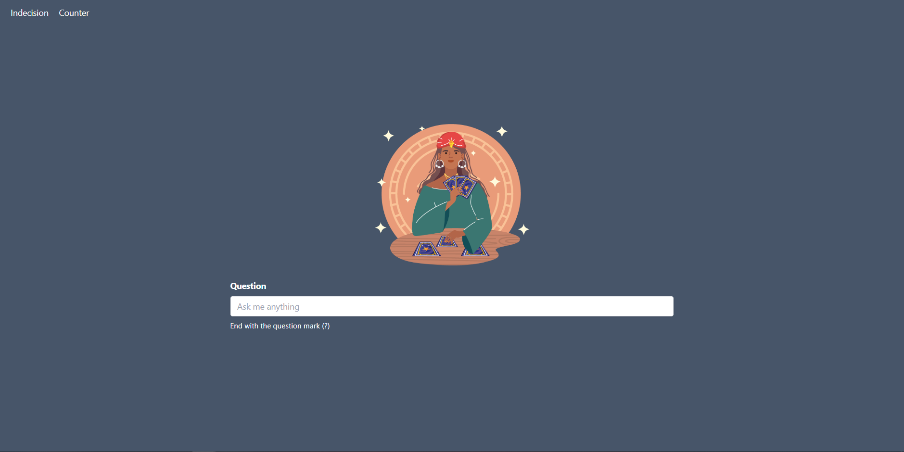
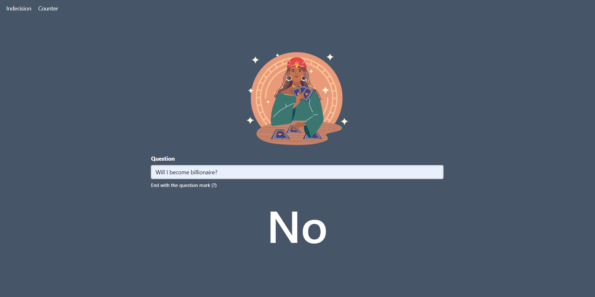
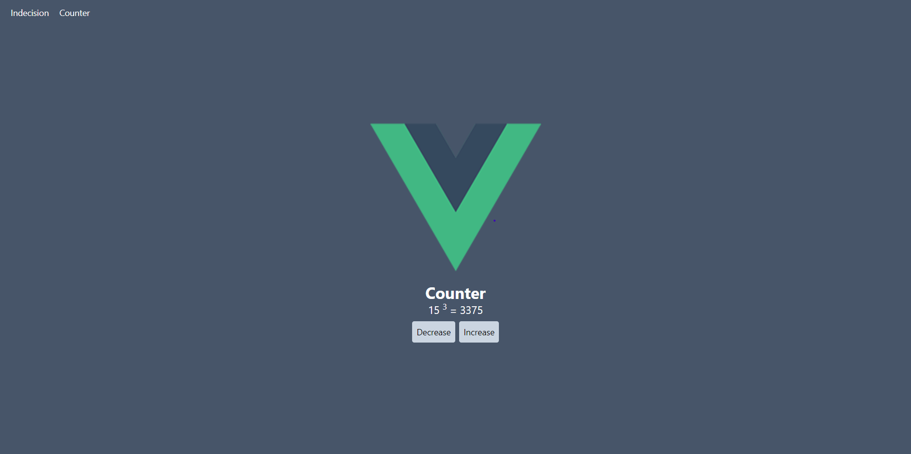

# Basics-Vue
This application is my first approach to the Vue framework.

### Functionality
- Change view between two components
- Send request to Yes/No API in Indecision Component (Fortune Teller) after the input recognize the question mark (?)
- Modify counter in Counter Component

## Installation
To install this project follow the next steps:
1. Download the repository found here: [Basics-Vue](https://github.com/SuaferoanTJK/Basics-Vue).
2. Run "**npm install**" script.
3. Run "**yarn serve**" script.
4. Go to http://localhost:8080
5. (Optional) If you want to run the test run "**yarn test:unit**" script.

## Screenshots

  
  
  

## Get in touch
### LinkedIn
https://www.linkedin.com/in/andrés-f-suárez/
